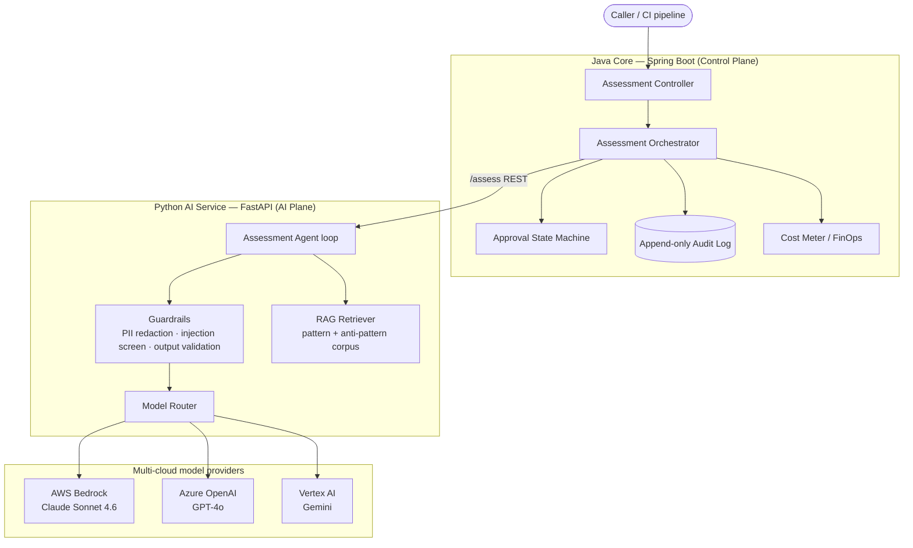
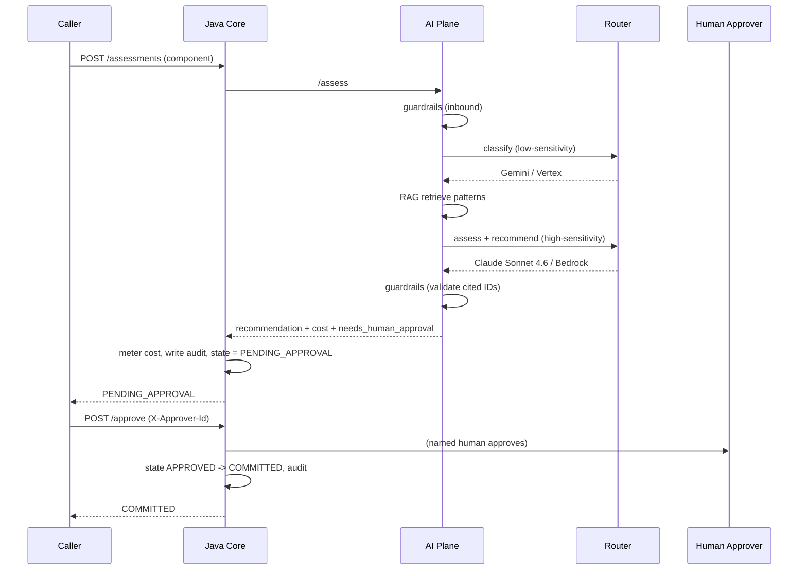

# Custodian — Architecture

## Component view

```mermaid
flowchart TB
    Client([Caller / CI pipeline])

    subgraph JC["Java Core — Spring Boot (Control Plane)"]
        GW[Assessment Controller]
        ORCH[Assessment Orchestrator]
        SM[Approval State Machine]
        AUD[(Append-only Audit Log)]
        COST[Cost Meter / FinOps]
    end

    subgraph PY["Python AI Service — FastAPI (AI Plane)"]
        ROUTER[Model Router]
        GUARD[Guardrails<br/>PII redaction · injection screen · output validation]
        RAG[RAG Retriever<br/>pattern + anti-pattern corpus]
        AGENT[Assessment Agent loop]
    end

    subgraph CLOUD["Multi-cloud model providers"]
        BR[AWS Bedrock<br/>Claude Sonnet 4.6]
        AZ[Azure OpenAI<br/>GPT-4o]
        VX[Vertex AI<br/>Gemini]
    end

    Client --> GW --> ORCH
    ORCH --> SM
    ORCH --> AUD
    ORCH --> COST
    ORCH -->|/assess REST| AGENT
    AGENT --> GUARD --> ROUTER
    AGENT --> RAG
    ROUTER --> BR
    ROUTER --> AZ
    ROUTER --> VX
```

## Assessment + approval sequence

```mermaid
sequenceDiagram
    participant C as Caller
    participant J as Java Core
    participant P as AI Plane
    participant R as Router
    participant H as Human Approver

    C->>J: POST /assessments (component)
    J->>P: /assess
    P->>P: guardrails (inbound)
    P->>R: classify (low-sensitivity)
    R-->>P: Gemini / Vertex
    P->>P: RAG retrieve patterns
    P->>R: assess + recommend (high-sensitivity)
    R-->>P: Claude Sonnet 4.6 / Bedrock
    P->>P: guardrails (validate cited IDs)
    P-->>J: recommendation + cost + needs_human_approval
    J->>J: meter cost, write audit, state = PENDING_APPROVAL
    J-->>C: PENDING_APPROVAL
    C->>J: POST /approve (X-Approver-Id)
    J->>H: (named human approves)
    J->>J: state APPROVED -> COMMITTED, audit
    J-->>C: COMMITTED
```
